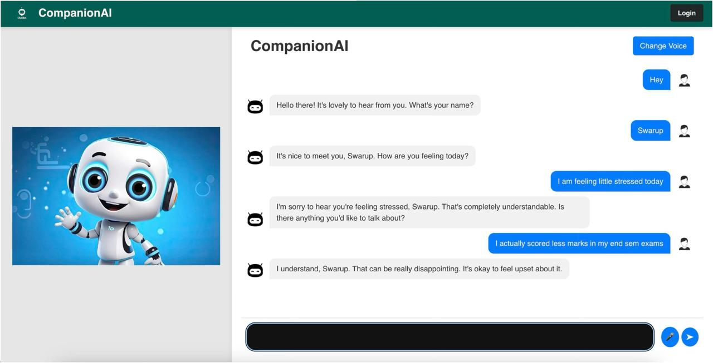

# CompanionAI

CompanionAI is a reliable AI friend chatbot designed to provide real-time conversational assistance, emotional support, and personalized interactions for users. It engages in friendly conversations, answers queries accurately, and offers custom assistance tailored to individual user needs.

## Images

  
  
  


## Features

- Real-time conversational AI with empathetic responses  
- Voice input with selectable male and female AI voices  
- Speech-to-text transcription leveraging Google API  
- Processes psychological context using LangChain and LLMs for relevant, supportive replies  
- Web interface with user login and voice selection  

## Technology Stack

- Backend AI powered by LangChain with LLM integration  
- Speech-to-text using Google Speech API  
- Frontend web interface with real-time chat and voice interaction  
- JSON API communication between frontend and backend  

## Usage

The bot accepts voice input or text, transcribes speech to text, and processes queries using a combination of human psychology PDFs. It returns personalized, empathetic responses aimed at alleviating loneliness and depression.

## Future Scope

- Multilingual voice integration with real-time translation  
- Lifelike 3D animated avatars with realistic expressions and lip-syncing  
- Enhanced emotional recognition using facial expressions and tone analysis  
- AI-based content moderation for safe interactions

## To Run

### Backend Setup

1. Navigate to the project directory:
   ```bash
   cd CompanionAI-The-Reliable-AI-Friend
   ```
2. Install Node Module Packages:
   ```bash
   npm install
   ```
3. Run the backend server:
   ```bash
   node app.js
   ```

### Frontend Setup

1. Navigate to the frontend directory and install dependencies:
   ```bash
   cd frontend
   npm install
   ```
2. Start the frontend development server:
   ```bash
   npm run dev
   ```
3. Access the application at `http://localhost:5173`.
